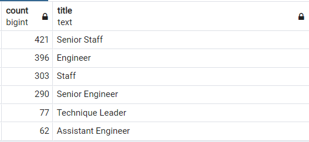

# Pewlett-Hackard-Analysis

## Overview

The purpose of this analysis is to work with Bobby to determine the number of retiring employees per title, and identify employees who are eligible to participate in a mentorship program. This will help Bobby’s manager prepare for the “silver tsunami” as a lage number of current employees reach retirement age shortly.

## Results

* A large number of Engineer and Senior Engineers are set to be part of the "Silver Tsunami"
* A large number of Staff and Senior Staff are set to be part of the "Silver Tsunami"
* Senior staff form the highest count of employees eligible for the mentorship program
* Assistant Engineer form the lowest count of emloyees eligible for the mentorship program

## Summary

